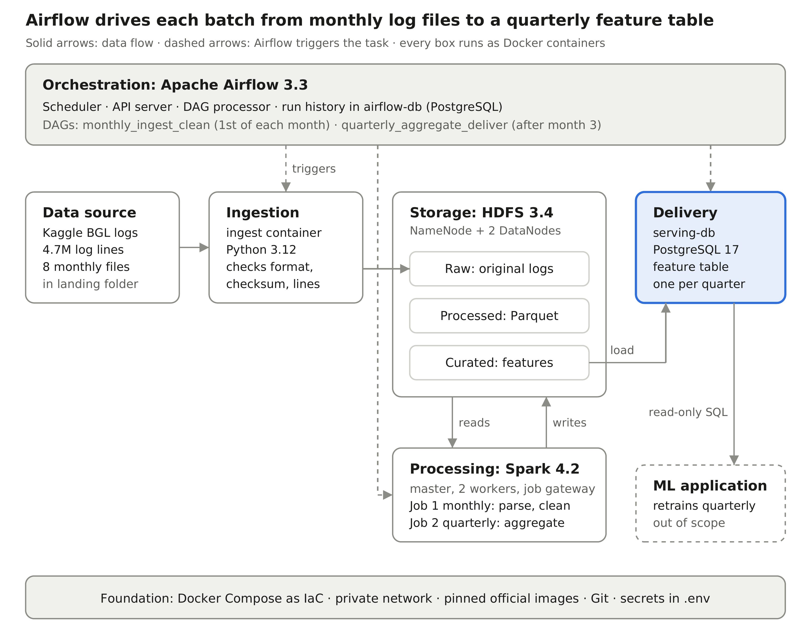

# Batch-processing data architecture for a data-intensive ML application

Portfolio project, Data Engineering (IU) – Phase 2: development.

A local, reproducible batch pipeline that ingests the **BGL supercomputer system log**
(4,747,963 timestamped log lines, Loghub / Kaggle), stores it in an HDFS data lake, cleans it
monthly and aggregates hourly machine-learning features quarterly with Apache Spark, and
delivers them to a PostgreSQL database for an ML application. Apache Airflow orchestrates
everything. Every component runs as its own Docker container, defined as code in
[`docker-compose.yml`](docker-compose.yml).



## Services

| Stage | Container(s) | Image | Purpose |
|---|---|---|---|
| Ingestion | `ingest` | `python:3.12-slim` + own code | Validates the monthly log file (format, checksum) and uploads it unchanged to HDFS via WebHDFS |
| Storage | `hdfs-namenode`, `hdfs-datanode-1`, `hdfs-datanode-2`, `hdfs-init` | `apache/hadoop:3.4.3` (+ data dir) | Data lake with three zones: `/data/raw`, `/data/processed`, `/data/curated`; replication factor 2 |
| Processing | `spark-master`, `spark-worker-1`, `spark-worker-2`, `spark-gateway` | `spark:4.2.0-python3` + JDBC driver + jobs | Monthly parsing/cleaning, quarterly aggregation; the gateway runs `spark-submit` on request |
| Delivery | `serving-db` | `postgres:17` + init script | Feature table `features.midplane_hourly`, read-only user `ml_reader`, audit table |
| Orchestration | `airflow-apiserver`, `airflow-scheduler`, `airflow-dag-processor`, `airflow-init`, `airflow-db` | `apache/airflow:3.3.2`, `postgres:17` | Two DAGs: `monthly_ingest_clean`, `quarterly_aggregate_deliver` |

Web interfaces (only reachable from your own machine):

| URL | What |
|---|---|
| http://localhost:8080 | Airflow (login from your `.env`) |
| http://localhost:9870 | HDFS NameNode (Utilities → Browse the file system) |
| http://localhost:8090 | Spark master (workers, running and completed jobs) |
| `localhost:5433` | Serving database (PostgreSQL) for the ML application |

## Requirements

* **Docker Desktop** (Windows, macOS) or Docker Engine with the Compose plugin (Linux).
* **Memory:** give Docker at least **8 GB RAM** (Docker Desktop → Settings → Resources).
  With 16 GB or more on your laptop, the default settings work. With 8 GB in total, set
  `SPARK_WORKER_MEMORY=1g` and `SPARK_EXECUTOR_MEMORY=768m` in `.env`.
* About 5 GB of free disk space (images + data).
* Internet access for the first build and for the dataset download (~58 MB zipped).

## Quick start

All commands are run in the project folder (PowerShell, Terminal or Git Bash).

**1. Create the secrets file `.env`** (random passwords, never committed to Git)

```bash
python scripts/generate_env.py
```

No Python on your computer? Copy `.env.example` to `.env` and replace every `change-me` by
your own value (the Fernet key must be 44 characters of URL-safe base64; you can also leave it
empty for a local test).

**2. Build the images**

```bash
docker compose build
```

**3. Download the dataset and split it into monthly landing files** (one-off)

```bash
docker compose run --rm --no-deps ingest python prepare_data.py
```

This downloads the BGL log from Kaggle if `KAGGLE_USERNAME`/`KAGGLE_KEY` are set in `.env`,
otherwise the identical original archive from Zenodo, and writes 8 files
`data/landing/bgl_2005-06.log` … `bgl_2006-01.log`. This simulates one log delivery per month.

**4. Start the system**

```bash
docker compose up -d
docker compose ps
```

Wait until all long-running services show `healthy` (2–3 minutes on the first start).
`hdfs-init` and `airflow-init` are one-off jobs and show `exited (0)`.

**5. Unpause the DAGs** – open http://localhost:8080, log in, switch both DAGs on.

**6. Replay the history with an Airflow backfill**

```bash
docker compose exec airflow-scheduler airflow backfill create --dag-id monthly_ingest_clean --from-date 2005-06-01 --to-date 2006-01-01 --max-active-runs 1
docker compose exec airflow-scheduler airflow backfill create --dag-id quarterly_aggregate_deliver --from-date 2005-04-01 --to-date 2006-01-01 --max-active-runs 1
```

(Alternatively, in the Airflow UI: open the DAG → *Trigger* → *Backfill* with the same dates.)

This creates 8 monthly runs (June 2005 – January 2006) and 4 quarterly runs (2005Q2 – 2006Q1).
The quarterly runs wait automatically until all months of their quarter are cleaned.
The automatic run for the current month is *skipped*, because the dataset contains no log
file for it – this is expected.

**7. Check the result**

```bash
# feature table, read as the ML application would (read-only user)
docker compose exec serving-db psql -U ml_reader -d serving -c "SELECT quarter, count(*) AS rows, count(DISTINCT midplane) AS midplanes, count(*) FILTER (WHERE alert_next_hour) AS positive_labels FROM features.midplane_hourly GROUP BY quarter ORDER BY quarter;"

# audit trail (lineage, row counts, checksums)
docker compose exec serving-db psql -U serving_admin -d serving -c "SELECT stage, partition_key, rows_in, rows_out, rows_rejected, status, left(checksum_sha256, 12) FROM governance.pipeline_runs ORDER BY id;"

# data lake zones
docker compose exec hdfs-namenode hdfs dfs -du -h /data/raw/bgl /data/processed/bgl /data/curated/bgl_features
```

## Pipeline details

**Monthly DAG `monthly_ingest_clean`** (data interval = one month)

1. `ingest_raw` – the ingest service checks the landing file (name, line format, month of every
   line), computes a SHA-256 checksum, rejects the file if more than 1 % of the lines are
   malformed, and uploads it unchanged to `/data/raw/bgl/year=YYYY/month=MM/`.
2. `parse_clean` – Spark job `parse_clean_month.py`: removes duplicate lines, parses the ten
   fields, converts the Unix time to UTC, derives rack and midplane from the node ID, masks IP
   addresses, e-mail addresses and user names (`<IP>`, `<EMAIL>`, `<USER>`), builds a message
   template, stops if the malformed share is too high (data-quality gate) and writes Snappy
   Parquet to `/data/processed/bgl/year=YYYY/month=MM/`.

**Quarterly DAG `quarterly_aggregate_deliver`**

1. `wait_for_cleaned_months` – sensor (reschedule mode) until every month of the quarter is cleaned.
2. `aggregate_and_deliver` – Spark job `aggregate_quarter.py`: one row per midplane and hour with
   event counts per severity and component, distinct templates and nodes, alert count and the
   label `alert_next_hour`; written to `/data/curated/bgl_features/quarter=YYYYQn/` and loaded
   into `features.midplane_hourly` (old rows of the quarter are replaced).
3. `verify_delivery` – connects as `ml_reader` and checks that the quarter can be read.

**Re-run a single month or quarter:** in the Airflow UI click *Trigger* on the DAG and set the
parameter `month` (e.g. `2005-07`) or `quarter` (e.g. `2005Q3`). Every job overwrites exactly
its own partition, so re-runs never duplicate data.

## Reliability, scalability, maintainability

* HDFS replication factor 2 (losing one DataNode loses no data); immutable raw zone.
* Idempotent jobs (overwrite one partition), Airflow retries, data-quality gates.
* Health checks, `restart: unless-stopped`, start order via `depends_on` conditions.
* Named Docker volumes for HDFS, both databases and the Airflow logs.
* Scale out by adding a `spark-worker-3` or `hdfs-datanode-3` block to `docker-compose.yml`.
* Pinned image and library versions; configuration in `.env` and `hdfs/hadoop.env`.

## Security, governance, protection

* One private Docker network; only the four web/database ports are published, and only on `127.0.0.1`.
* Secrets only in `.env` (git-ignored); generated randomly by `scripts/generate_env.py`.
* HDFS permissions on: the data-lake zones belong to the technical user `etl` (mode 750).
* PostgreSQL least privilege: `etl_writer` (write features and audit records), `ml_reader`
  (read-only, feature schema only, no access to `governance`).
* The Spark gateway only accepts the two known job names with integer arguments.
* Containers run as non-root users (`hadoop`, `spark`, `ingest`, `airflow`).
* Audit table `governance.pipeline_runs` records every load, cleaning and delivery step.
* Personal and network data (IP, e-mail, user names) is masked before it leaves the raw zone.

## Tests

Unit tests of the Spark transformations (parsing, deduplication, masking, features, label):

```bash
docker compose run --rm --no-deps spark-gateway /opt/spark/bin/spark-submit /opt/pipeline/tests/test_transform.py
```

## Stop, restart, reset

```bash
docker compose stop          # stop, keep all data
docker compose up -d         # start again
docker compose down -v       # remove containers AND all data volumes (full reset)
```

## Troubleshooting

| Problem | Fix |
|---|---|
| Containers restart or Spark jobs fail with "out of memory" | Increase Docker memory, or lower `SPARK_WORKER_MEMORY` / `SPARK_EXECUTOR_MEMORY` in `.env`, then `docker compose up -d` |
| A port is already in use | Change the left-hand port in `docker-compose.yml`, e.g. `"127.0.0.1:8081:8080"` |
| Linux: `prepare_data.py` cannot write to `data/` | `sudo chown -R 1000:1000 data` (the ingest container runs as user 1000) |
| A task failed | Airflow UI → DAG → failed task → *Logs*; Spark job output is included in the task log |
| Start again from zero | `docker compose down -v`, then step 4 |

## Project structure

```
├── docker-compose.yml          all services, networks, volumes (Infrastructure as Code)
├── .env.example                configuration template (copy to .env)
├── hdfs/                       Hadoop image extension + configuration
├── ingest/app/                 ingestion service, data preparation, BGL format
├── spark/gateway/              job gateway (HTTP -> spark-submit)
├── spark/jobs/                 Spark jobs and transformations
├── spark/tests/                unit tests
├── airflow/dags/               monthly and quarterly DAGs + shared helpers
├── postgres/serving-init/      schemas, tables, users and privileges
├── scripts/generate_env.py     creates .env with random secrets
├── data/landing, data/download dataset (not in Git)
└── docs/                       architecture diagram, screenshots
```

## Data source

Zhu, J., He, S., He, P., Liu, J., & Lyu, M. R. (2023). Loghub: A large collection of system log
datasets for AI-driven log analytics. *IEEE ISSRE*. Dataset on Kaggle:
[LogHub – BGL Log Data](https://www.kaggle.com/datasets/omduggineni/loghub-bgl-log-data);
original archive: [Zenodo record 8196385](https://zenodo.org/records/8196385). Free for research purposes.
